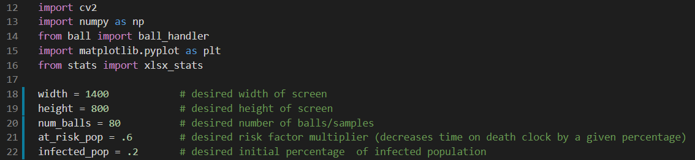
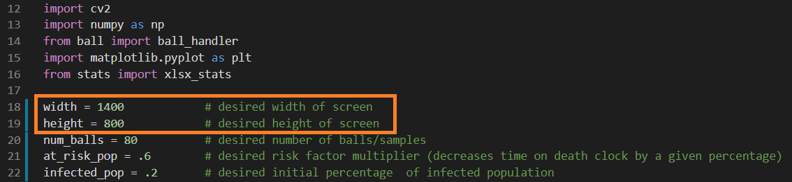
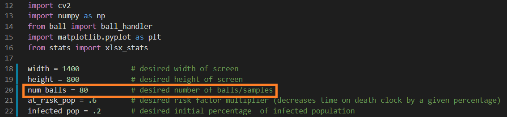
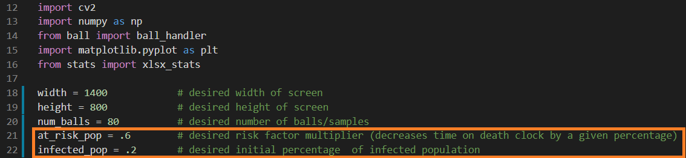
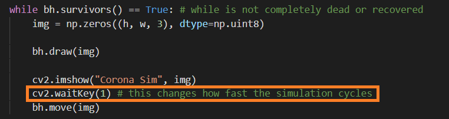

# Corona Simulator

## Overview
This program attempts to model a live spread of COVID within a population while displaying the health status of each of the individuals: Healthy, infected, dead, recovered/immune. The program uses balls to represent people, a window boundary to represent a community, and linear motion to represent an individuals movement within the community. The simulation continues until the infection has disappeared from the population through killing the host and/or the host recovering. The program then will display a graph showing the health status data of the population over time.

## How To Use Program
The scripts needed to run this program are **ball.py** and **corona_simulator.py**. 

Upon initializing parameters in **corona_simulator.py** script, run the **corona_simulator.py** script to execute program.
*Follow steps below for details on where/how to initialize parameters*

## Initializing Parameters in **corona_simulator.py** Script
In the first few lines of this script, immediately after imports, you will find the five key adjustable parameters of this program which affect the size of the boundary, size of the sample population, and health status of sample population. 

### Initializing Size of the Boundary
Here, the width and height variables that are set affect the size of the pop up window boundary. 

For best visuals, it's recommended to set the size smaller than the width and height of the screen it will be viewed on. 
Although, it will still behave functionally if the window exceeds size of the screen.

*Increasing the area of the boundary typically decreases the rate of transmission*

### Initializing Size Sample Population
Here, the number of samples/balls is initialized. 

*Increasing the sample size typically increases the rate of transmission*
*Increasing the sample size can be tolling on the CPU, decrease sample size if program runs too slowly*

### Initializing Health Status of Sample Population
The two variables here affect the initial percentage of the population that is infected and initial percentage of the population that
is considered "at risk" meaning they have a greater chance of dying if infected.

Example: 
If we set initial population to num_balls=100, at risk population to at_risk_pop=.5, and infected population to infected_pop to .2
Total Population: 100
- Percentage of Healthy Population:    80% (80 samples)
- Percentage of Infected Population:   20% (20 samples)
- Percentage of At Risk Population:    50% (50 samples)
*Note that the "at risk" population can be in either the healthy or infected categories or both*
*See **Further Customizations** for algorithm details on initializing health statuses*

*Increasing the infected sample size typically increases the rate of transmission*
*Increasing the At Risk sample size typically increases the total number of deaths*

### Optional Parameter (waitkey)
Also contain in the **corona_simulator.py** script a few lines below where initial parameters are given within the while loop,
*while bh.survivors() == True*, the waitkey can be edited to change the speed of the simulation (how fast the balls move).

*Increasing the value of the waitkey will decrease the speed of the simulation (speed of balls)*

## Further Customizations

## Future Improvement Ideas
